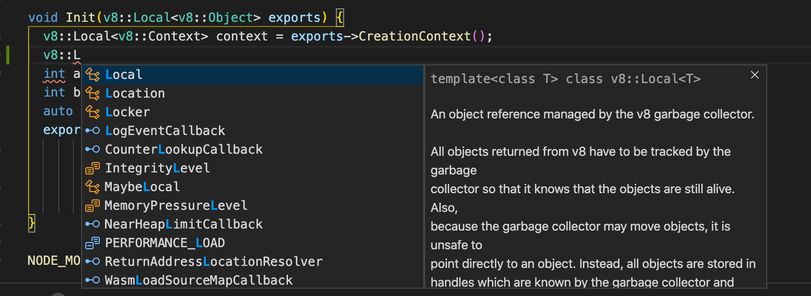
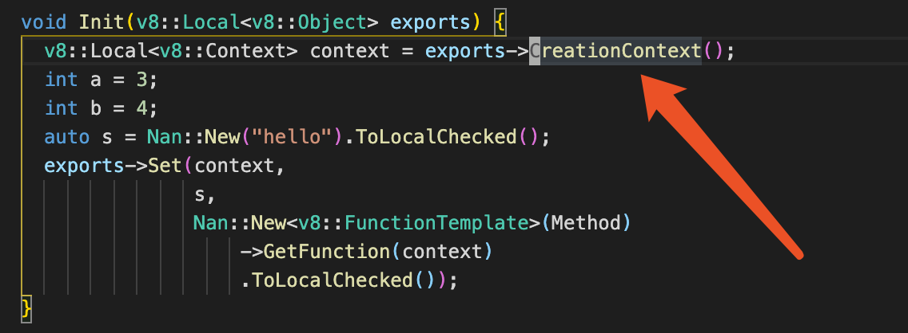
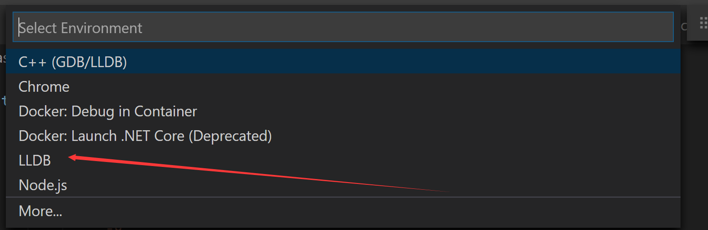
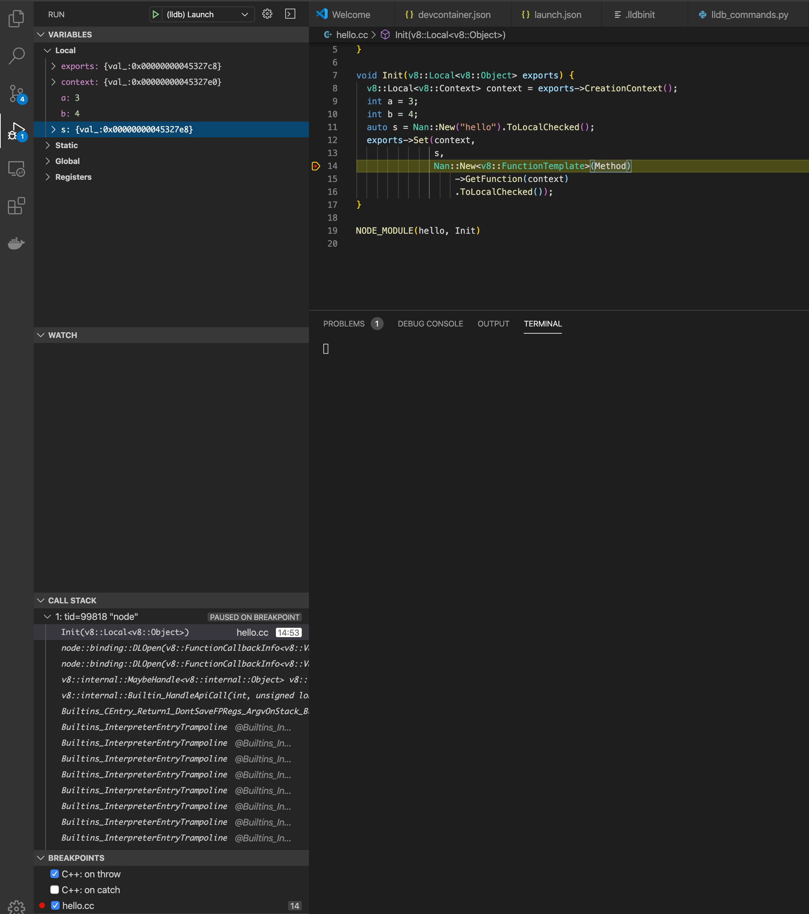

# Debug Node.js addon and Node.js core

This blog should guide you how to debug Node.js addon using [Visual Studio Code](https://code.visualstudio.com/).
You can apply it to other project too.

Don't be scared, it's very simple, let's have some fun.

It covered: 
* code autocompletion and go to implementation
* debug code

## Prerequisite

Install vscode and this [plugin](https://marketplace.visualstudio.com/items?itemName=ms-vscode-remote.remote-containers).
In the page, it will instruct you how to install Docker.

## Code writing 

After setup all the devtools, clone this repo (most the code is copied 
from https://github.com/nodejs/node-addon-examples/tree/master/1_hello_world/nan).
Run the `Remote-Containers: Open Folder in Container...` command and select the local folder.
After vscode open a new window. It will take some time to open this project, 
mainly pulling the docker Image `gengjiawen/node-build`.

### Generate config for cpp 

Execute `node-gyp configure -- -f compile_commands_json` in terminal.
By running the command `C/C++: Edit Configurations (UI)` from the Command Palette,
this would generate `.vscode/c_cpp_properties.json` file for you
Edit it by adding `"compileCommands": "${workspaceFolder}/Debug/compile_commands.json",`
This final file look like this:

```json
{
    "configurations": [
        {
            "name": "Linux",
            "includePath": [
                "${workspaceFolder}/**"
            ],
            "defines": [],
            "compilerPath": "/usr/bin/clang",
            "compileCommands": "${workspaceFolder}/Debug/compile_commands.json",
            "cStandard": "c11",
            "cppStandard": "c++17",
            "intelliSenseMode": "clang-x64"
        }
    ],
    "version": 4
```

You now should edit the code, open `hello.cc`, now you can use code completion and navigation

code auto completion


code navigation


## Debug
Debug plugin relies [vscode-lldb](https://github.com/vadimcn/vscode-lldb)

Press F5, and choose `LLDB` in prompt


After generated config (location in `.vscode/launch.json`), edit `program` and `args` part.

This final config looks like this
```json
{
    "version": "0.2.0",
    "configurations": [
        {
            "type": "lldb",
            "request": "launch",
            "name": "Debug",
            "program": "node",
            "args": ["hello.js"],
            "cwd": "${workspaceFolder}"
        }
    ]
}
```
Then set breakpoint in `hello.cc`, then print `F5` again. You should see something like this



You may notice the variable `s` value information is not helpful. It's a `v8::Value`,
we are working on it to make it more informative.

## Q & A
If you want to debug native OS api like windows specific api, you can
use the same way. But you need to setup the whole dev yourself, like C++ 
compiler, python and other staff. You can also try other IDE support like 
Visual studio or Clion by generating cmake config using `node-gyp configure -- -f cmake`.

## Credit

Most thankful to @joyeecheung @danbev @addaleax @bnoordhuis @hsiaosiyuan0 for their amazing work
and inspirations.

## Ref
* https://joyeecheung.github.io/blog/2018/12/31/tips-and-tricks-node-core/
* https://code.visualstudio.com/docs/remote/containers
* https://github.com/vadimcn/vscode-lldb
* https://medium.com/fhinkel/debug-v8-in-node-js-core-with-gdb-cc753f1f32
* https://github.com/bnoordhuis/v8-cmake/pull/8
* https://github.com/Microsoft/vscode-remote-try-node
